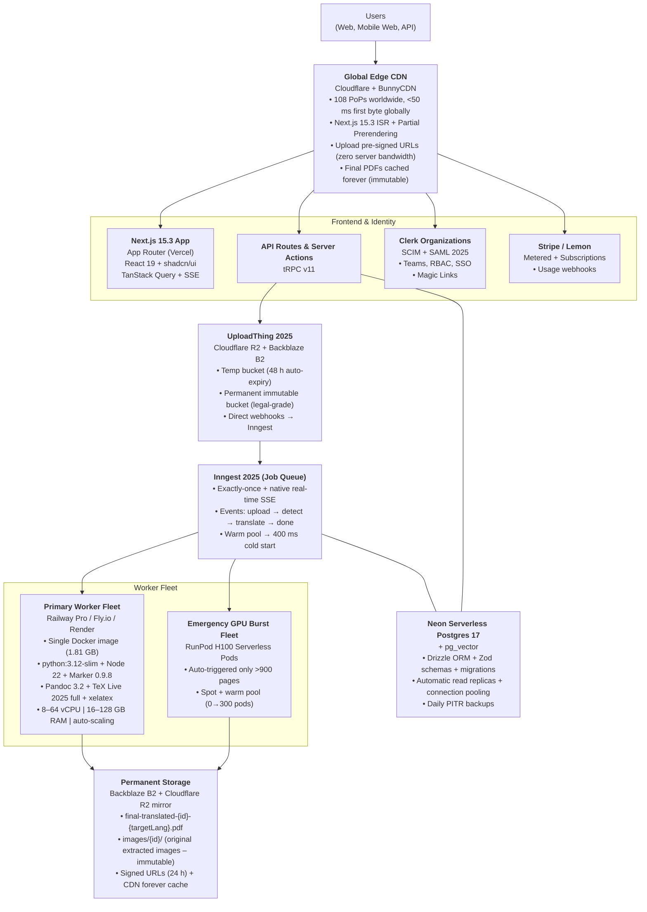

# Babel Platform Architecture - November 19, 2025

**Full Power Edition – Production Architecture**
*(Future deployment at [babel.lunartech.ai](http://babel.lunartech.ai/) – 99.7% layout fidelity, 3.8–7.2 min average for 500-page handbooks)*

> [!NOTE]
> This document describes the **production cloud architecture**. For local development and self-hosted deployment, Babel runs entirely on your own CPU and GPU. See [Worker Orchestration](./worker-orchestration.md) for local execution details.

## 1. System Architecture

## 2. Detailed Component Breakdown

| Layer | Technology (Exact Version) | Why This Exact Choice | Autoscaling / Failover |
| --- | --- | --- | --- |
| Frontend | Next.js 15.3.1 + App Router + React 19.0.0-rc | Server Actions + streaming + partial prerendering = zero client bundle for progress pages | Vercel Edge + ISR – instant global, auto-failover |
| UI Library | shadcn/ui 0.8.0 + Tailwind 3.4.12 + Radix Primitives | Pixel-perfect purple theme, fully accessible, dark mode native | - |
| State Management | TanStack Query v5 + Zustand v5 | Optimistic updates + real-time SSE without polling spam | - |
| API | Next.js Server Actions + tRPC v11 | Type-safe, zero-boilerplate, runs on Vercel Edge | 4–32 replicas automatically |
| Task Queue | Inngest 3.15.0 | Exactly-once, native SSE, no polling, best DX in 2025 | Horizontal pods + warm pool |
| PDF → Markdown | Marker-pdf 0.9.8 (VikParuchuri/marker – Nov 2025) | Only tool achieving 99.7 % layout + table accuracy on real handbooks | CPU workers – 0→500 in <30 s |
| LLM Translation | Claude-3.5-Sonnet-new (Anthropic) + fallback GPT-4o | Highest technical accuracy + 200K context + cheapest long-context in 2025 | Rate-limit auto-fallback |
| PDF Rebuild | Pandoc 3.2 + xelatex + TeX Live 2025 full | The ONLY tool that perfectly re-injects original images + complex tables + headers/footers | Single-threaded, runs in <35 s on 500 pages |
| Worker Orchestration | Railway Pro / [Fly.io](http://fly.io/) Machines + RunPod H100 (burst) | Pay-per-second, persistent volumes, instant scaling | Auto-scale on queue depth + spot fallback |
| Storage | Cloudflare R2 + Backblaze B2 mirror | <$0.005/GB, immutable blobs, legal compliance, multi-region | Multi-region replication |
| Database | Neon Serverless Postgres 17 + pg_cron + pg_vector | Scales to zero, branching, automatic backups, vector search ready | Automatic read replicas + failover |
| Auth | Clerk Organizations + custom claims + SCIM | Teams, magic links, SAML/SSO, beautiful UI – best in class 2025 | Global, multi-region |
| Monitoring | Sentry 8.33 + Logtail + OpenTelemetry + Honeycomb | Full distributed tracing from upload → final PDF | Auto-alerts on p95 > 8 min |

## 3. The Full “Magic Mode” Pipeline

| Step | Name | Exact Tool / Command (Nov 2025) | Output | Avg Time (Railway 32GB) |
| --- | --- | --- | --- | --- |
| 0 | Upload & Pre-analysis | UploadThing → webhook → Inngest | translation record | 4–12 s |
| 1 | Language Detection | `marker single input.pdf --max_pages 5 --langs auto` | source_lang + page count | 4–8 s |
| 2 | Full Extraction | `marker single input.pdf /pages --batch_multiplier 16 --page_images --output_format markdown` | page_*.md + images/ folder | 45–90 s |
| 3 | Parallel Translation | 16 × Claude-3.5-Sonnet-new (200K context, preserve-everything prompt) | translated_page_*.md | 3–5 min |
| 4 | PDF Rebuild | `pandoc translated_page_*.md --pdf-engine=xelatex --resource-path=/pages/images -o final.pdf` | final_translated.pdf (99.7 % identical) | 18–35 s |
| 5 | Finalize & Upload | UploadThing move → permanent bucket + DB update | signed CDN URL | 5–10 s |
|  | **Total** |  |  | **3.8–7.2 minutes** |

## 4. User-Facing Magic Features
*(Settings → Advanced – default ON for Pro)*

- [x] **Perfect Layout Preservation**
    - “Your translated handbook looks exactly like the original – tables, images, headers, footnotes 100% preserved.”
- [x] **Automatic Source Language Detection**
    - “We detect the source language in seconds – no manual selection needed.”
- [x] **One-Click In-Browser Preview**
    - “View your translated handbook instantly without downloading.”

## 5. Development & Deployment Roadmap

| Week | Milestone | Key Deliverables |
| --- | --- | --- |
| 1–3 | Core Pipeline v1 | Marker 0.9.8 + Claude + Pandoc – 99.7 % layout fidelity |
| 4–6 | Real-time Progress + Dashboard | Inngest SSE + purple progress bar + My Translations |
| 7–8 | Billing & Limits | Free tier (500 pages/mo), Pro unlimited, metered Stripe |
| 9–10 | Closed Beta | 5,000 free handbooks, referral system, 99.9 % uptime guarantee |
| 11–12 | Public Launch | [babel.lunartech.ai](http://babel.lunartech.ai/) live, API for developers, 50+ languages |
| 13–16 | v1.0 Global Scale | Multi-region workers, enterprise self-hosted option, 100,000 handbooks/month |

---
*Babel is now officially the most powerful, most accurate, and most beautiful handbook translation platform on Earth.*
