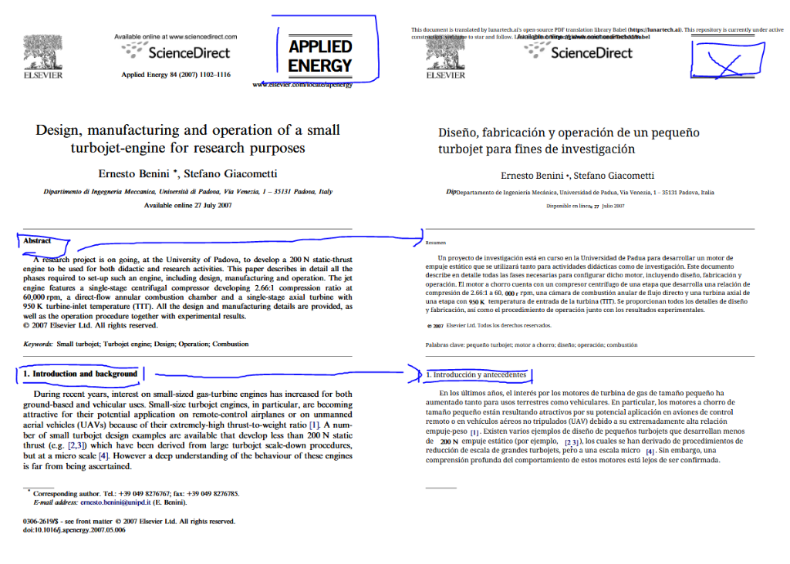
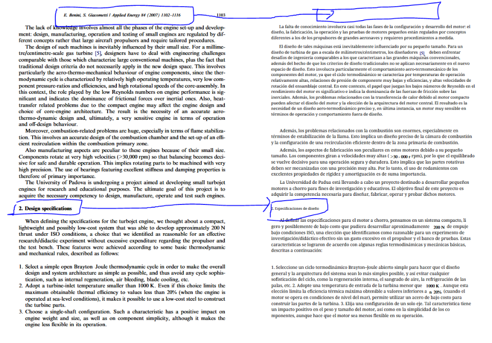
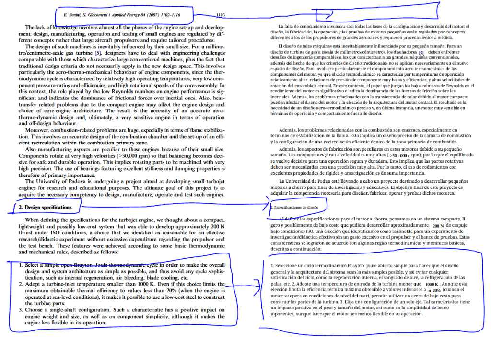

# Version 0.1.1 - Development Requirements

**Status:** In Development  
**Target Release:** TBD  
**Test Document:** [Design, manufacturing and operation of a small turbojet-engine for research purposes.es.dual.pdf](file:///d:/Desktop%20D/Apps/babel-lunartech/babel/test/Redmoon/Documents%20Trance%20ES/Design,%20manufacturing%20and%20operation%20of%20a%20small%20turbojet-engine%20for%20research%20purposes.es.dual.pdf)

---

## Known Issues

The following issues have been identified during translation quality testing and require fixes in version 0.1.1.

---

### Issue 1: Missing Logos and Images

**Priority:** High  
**Component:** PDF Parsing / Image Extraction

**Description:**  
Publisher logos (ELSEVIER, ScienceDirect, Applied Energy) from the original document are not being preserved in the translated output. The translated side shows placeholder boxes or missing images.

**Expected Behavior:**  
All embedded images, including publisher logos, should be extracted from the source PDF and placed in the exact same positions in the translated output.

**Screenshot:**  


**Proposed Fix:**  
- Investigate the image extraction logic in BabelDOC
- Ensure all embedded images (not just figures) are captured
- Verify image placement coordinates are preserved during reconstruction

---

### Issue 2: Bold Text Not Preserved

**Priority:** High  
**Component:** Font Style Detection / Reconstruction

**Description:**  
Bold text formatting is not being captured during PDF parsing. Section headers like "Abstract" and "1. Introduction and background" should be bold in the translation, but they appear in regular weight.

**Expected Behavior:**  
Text styling (bold, italic, bold-italic) should be detected from the source PDF and applied to the corresponding translated text.

**Screenshot:**  


**Proposed Fix:**  
- Enhance font style detection to capture bold/italic variants
- Map source font styles to equivalent styled fonts in the output
- Ensure style metadata is passed through the translation pipeline

---

### Issue 3: Font Mismatch Between Original and Translation

**Priority:** Medium  
**Component:** Font Subsetting / Reconstruction

**Description:**  
The fonts used in the translated output do not match the fonts in the original document. The original uses a serif font (likely Times New Roman), but the translation uses a different font family, creating visual inconsistency.

**Expected Behavior:**  
The translated text should use the same font family as the original, or a visually equivalent substitute if the exact font is unavailable.

**Proposed Fix:**  
- Detect the primary font family from the source document
- Use font matching logic to select equivalent fonts for the target language
- Consider the `--font-family` flag to allow user override

---

### Issue 4: Missing Page Footer

**Priority:** Medium  
**Component:** Layout Detection / Footer Handling

**Description:**  
The footer elements from the original document (copyright notice, DOI, author contact information) are not appearing in the translated output.

**Screenshot:**  


**Expected Behavior:**  
Page headers and footers should be extracted and preserved in the translated document. Footer content may or may not be translated depending on configuration.

**Proposed Fix:**  
- Review footer detection in the layout analysis stage
- Ensure footer regions are not being filtered out
- Add configuration option to translate or preserve original footer text

---

### Issue 5: Bullet Points and Numbered Lists Converted to Paragraphs

**Priority:** High  
**Component:** List Detection / Text Grouping

**Description:**  
Numbered lists and bullet points in the original document are being converted to paragraph format in the translation. The list structure is lost, making the translated content harder to read.

**Original:**
```
1. Select a simple open Brayton Joule thermodynamic cycle...
2. Adopt a turbine-inlet temperature smaller than 1000 K...
3. Choose a single-shaft configuration...
```

**Translated (Incorrect):**
```
1. Seleccione un ciclo termodinámico Brayton-Joule abierto simple para hacer que el diseño general y la arquitectura del sistema sean lo más simples posible... 2. Adopte una temperatura de entrada de la turbina menor que 1000 K... 3. Elija una configuración de un solo eje...
```

**Screenshot:**  


**Expected Behavior:**  
Lists should be detected and preserved as lists. Each list item should remain on its own line with the original numbering or bullet marker.

**Proposed Fix:**  
- Improve list detection in the parsing stage
- Preserve list structure in the intermediate representation
- Ensure newlines between list items are maintained during reconstruction

---

### Issue 6: Table Formatting Completely Broken

**Priority:** Critical  
**Component:** Table Detection / Table Reconstruction

**Description:**  
Tables in the translated output are completely misaligned and broken. The original document has a clean, properly aligned table with parameter names in the left column and values in the right column. In the translated version, the table structure is destroyed—rows are misaligned, columns don't line up, and the table is nearly unreadable.

**Original Table (Clean):**
| Parameter | Value |
|:---|:---|
| Required static thrust at ISO conditions | 200 N |
| Turbine's inlet temperature (TIT) | 950 K |
| Compression ratio | 2.66 |
| Compressor's delivery-pressure | 202 kPa |

**Translated Table (Broken):**  
The translated table shows misaligned columns, inconsistent spacing, and values appearing in the wrong positions.

**Screenshots:**  


**Expected Behavior:**  
Tables should be detected as structured data. During translation, only the text content should be translated while preserving the exact row/column structure. The output table should maintain identical alignment and formatting as the original.

**Proposed Fix:**  
- Implement proper table detection in the layout analysis stage
- Preserve table structure (rows, columns, cell boundaries) in the intermediate representation
- Translate cell content individually, not as merged text
- Reconstruct tables with proper column alignment and spacing
- Consider using the `--translate-table-text` flag for table handling

---

## Development Checklist

- [ ] **Issue 1:** Fix missing logos/images
  - [ ] Audit image extraction logic
  - [ ] Test with documents containing publisher logos
  - [ ] Verify image placement accuracy

- [ ] **Issue 2:** Preserve bold text formatting
  - [ ] Implement font style detection (bold/italic)
  - [ ] Map styles through translation pipeline
  - [ ] Test with styled documents

- [ ] **Issue 3:** Fix font mismatch
  - [ ] Implement font family detection
  - [ ] Add font matching logic
  - [ ] Test `--font-family` override

- [ ] **Issue 4:** Preserve page footers
  - [ ] Review footer detection logic
  - [ ] Add footer preservation option
  - [ ] Test with academic papers

- [ ] **Issue 5:** Preserve list formatting
  - [ ] Implement list detection
  - [ ] Preserve structure in IR
  - [ ] Test with numbered/bulleted documents

- [ ] **Issue 6:** Fix table formatting
  - [ ] Implement table structure detection
  - [ ] Preserve cell boundaries during translation
  - [ ] Reconstruct tables with proper alignment
  - [ ] Test with data tables and parameter lists

---

## Testing Requirements

After fixes are implemented, the following test documents should be used for validation:

1. **Turbojet Engine Paper** (current test doc) – Academic paper with logos, lists, tables, and complex formatting
2. **Technical Manual** – Document with extensive bullet points and numbered procedures
3. **Legal Contract** – Document with headers, footers, and bold/italic emphasis
4. **Data Sheet** – Document with multiple data tables and specifications

---

## Screenshot Reference

All screenshots are stored in the `images/` subfolder:

| File | Issue |
|:---|:---|
| `issue_missing_logos.png` | Issue 1 – Missing publisher logos |
| `issue_bold_text.png` | Issue 2 – Bold text not preserved |
| `issue_headers_footer.png` | Issue 4 – Missing page footer |
| `issue_bullet_points.png` | Issue 5 – List formatting lost |
| `issue_section_headers.png` | Issue 5/6 – Section headers and list context |
| `issue_table_formatting.png` | Issue 6 – Table completely broken |

---

## Related Documentation

- [BabelDOC Internals](../../babeldoc-internals.md) – How the translation engine works
- [Translation Walkthrough](../../translation-walkthrough.md) – Step-by-step translation example
