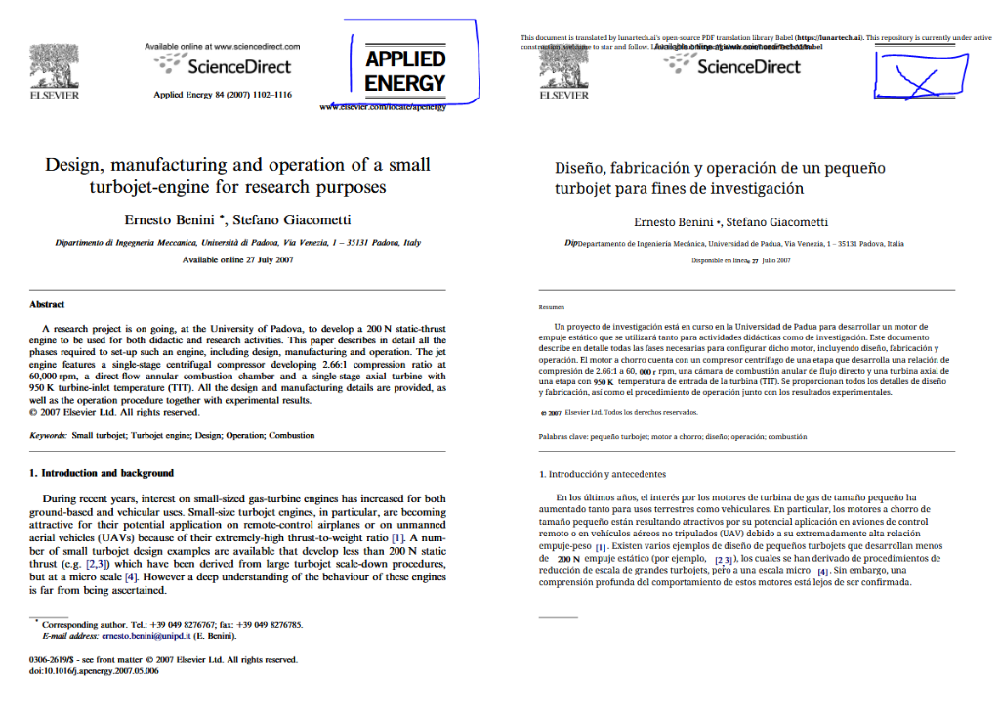
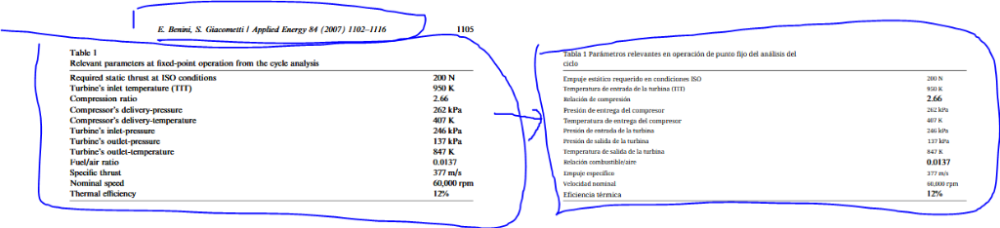

# AI ENGINEERING APPRENTICE PROGRAM


---

## Your 6-Month Odyssey from Aspiring Talent to AI Trailblazer

### Escaping the "No Experience, No Job" Loop

At LunarTech, we keep meeting incredibly motivated people who are stuck in the same loop: "Every role asks for experience, but no one wants to give me that first real chance."

You might be:
- Armed with self-taught knowledge, bootcamps, or early university projects, but constantly rejected for "lack of real experience".
- Pivoting careers, grinding through tutorials late at night, but craving the rush of applying your skills to actual, high-stakes products.
- An early-career professional who has done courses and projects, yet feels unprepared for the messy reality of production systems.

**Our highly competitive, remote-first LunarTech Apprenticeship Programs were created to break that loop.**

Over 6 months, you join an international AI startup, contribute to real products, and develop job-ready skills while being closely mentored by professionals. You're not just watching from the sidelines — you're in the arena.

---

## What is Babel?

Babel is LunarTech's flagship AI-powered document translation platform. Unlike conventional translation services that treat documents as flat text, Babel preserves the original formatting, layout, and structure of your documents — ensuring that complex PDFs with tables, charts, headers, and multi-column layouts are translated seamlessly.

### The Technology Stack:
- **Agentic OCR**: Intelligent optical character recognition that understands document structure, not just raw text.
- **Large Language Models (GPT-4o)**: Context-aware translation that understands nuance across entire documents.
- **PDF Reconstruction Engine**: Rebuilds translated documents with identical layouts and styling.
- **BabelDOC Core**: The engine that powers our high-fidelity translations with layout analysis and term extraction.

### Why This Experience Matters:

Working on Babel gives you real-world experience with some of the most in-demand technologies in AI engineering:

- **Document Intelligence**: Learn how to parse, analyze, and reconstruct complex document structures — a skill used in legal tech, healthcare, and enterprise software.
- **LLM Integration**: Gain hands-on experience integrating and optimizing large language models for production workloads.
- **Computer Vision**: Work with OCR systems, layout analysis, and image processing — core skills for any AI engineer.
- **Production Systems**: Debug, optimize, and ship code that serves real users — not just tutorial projects.

**By the end of your apprenticeship, you will have portfolio-ready experience solving complex AI engineering problems that companies actively hire for.**

---

## Your First Mission: Babel v0.1.1

You have been assigned to the **Babel Core Team**. Your immediate objective is to stabilize and enhance **Babel v0.1.1**, a version currently facing critical challenges in maintaining document integrity during translation.

### The Goal: "The Perfect Mirror"
A successful translation in Babel should be **the exact same document**, only in a different language. We are looking for 100% visual and structural fidelity.

- **Fidelity**: Font sizes, weights, and colors must be 100% accurate.
- **Identity**: Every logo and brand asset preserved in its exact spatial coordinate.
- **Structure**: Tables and lists must retain their precise grid and bullet logic.

### Your Journey Structure:
1. **Onboarding & Orientation (Weeks 1–4)**: Learn the tools, stack, workflows, and expectations. Complete guided onboarding quests.
2. **Deepening & Delivery (Weeks 5–12)**: Begin contributing to real features with increasing responsibility.
3. **Ownership & Impact (Weeks 13–20)**: Tackle complex challenges, participate in sprints, work towards a capstone contribution.
4. **Showcase & Transition (Weeks 21–24)**: Finalize portfolio pieces, present your work, receive certificate of completion.

### At LunarTech, you're joining:
- An AI-based, remote-first startup working on deep tech products
- An international, cross-functional team of engineers, designers, data scientists, and product builders
- A 6-month, part-time (20–25 hours/week) program you can fit around studies or other responsibilities
- A mentorship-first culture with structured feedback, not just "sink or swim" tasks

---

## Issue 1: Missing Logos and Images

**Priority:** HIGH  
**Component:** PDF Parsing / Image Extraction

**Description:**  
Publisher logos (ELSEVIER, ScienceDirect, Applied Energy) from the original document are not being preserved in the translated output. The translated side shows placeholder boxes or missing images.

**Expected Behavior:**  
All embedded images, including publisher logos, should be extracted from the source PDF and placed in the exact same positions in the translated output.

**Screenshot:**  


**Proposed Fix:**  
- Investigate the image extraction logic in BabelDOC
- Ensure all embedded images (not just figures) are captured
- Verify image placement coordinates are preserved during reconstruction

---

## Issue 2: Bold Text Not Preserved

**Priority:** HIGH  
**Component:** Font Style Detection / Reconstruction

**Description:**  
Bold text formatting is not being captured during PDF parsing. Section headers like "Abstract" and "1. Introduction and background" should be bold in the translation, but they appear in regular weight.

**Expected Behavior:**  
Text styling (bold, italic, bold-italic) should be detected from the source PDF and applied to the corresponding translated text.

**Screenshot:**  


**Proposed Fix:**  
- Enhance font style detection to capture bold/italic variants
- Map source font styles to equivalent styled fonts in the output
- Ensure style metadata is passed through the translation pipeline

---

## Issue 5: Bullet Points and Numbered Lists Converted to Paragraphs

**Priority:** HIGH  
**Component:** List Detection / Text Grouping

**Description:**  
Numbered lists and bullet points in the original document are being converted to paragraph format in the translation. The list structure is lost, making the translated content harder to read.

**Original:**
```
1. Select a simple open Brayton Joule thermodynamic cycle...
2. Adopt a turbine-inlet temperature smaller than 1000 K...
3. Choose a single-shaft configuration...
```

**Translated (Incorrect):**
```
1. Seleccione un ciclo termodinámico... 2. Adopte una temperatura... 3. Elija una configuración... (all collapsed into one paragraph)
```

**Screenshot:**  


**Expected Behavior:**  
Lists should be detected and preserved as lists. Each list item should remain on its own line with the original numbering or bullet marker.

**Proposed Fix:**  
- Improve list detection in the parsing stage
- Preserve list structure in the intermediate representation
- Ensure newlines between list items are maintained during reconstruction

---

## Issue 6: Table Formatting Completely Broken

**Priority:** CRITICAL  
**Component:** Table Detection / Table Reconstruction

**Description:**  
Tables in the translated output are completely misaligned and broken. The original document has a clean, properly aligned table with parameter names in the left column and values in the right column. In the translated version, the table structure is destroyed—rows are misaligned, columns don't line up, and the table is nearly unreadable.

**Expected Behavior:**  
Tables should be detected as structured data. During translation, only the text content should be translated while preserving the exact row/column structure. The output table should maintain identical alignment and formatting as the original.

**Screenshot:**  


**Proposed Fix:**  
- Implement proper table detection in the layout analysis stage
- Preserve table structure (rows, columns, cell boundaries) in the intermediate representation
- Translate cell content individually, not as merged text
- Reconstruct tables with proper column alignment and spacing

---

## Issue 4: Missing Page Footer

**Priority:** MEDIUM  
**Component:** Layout Detection / Footer Handling

**Description:**  
The footer elements from the original document (copyright notice, DOI, author contact information) are not appearing in the translated output.

**Expected Behavior:**  
Page headers and footers should be extracted and preserved in the translated document. Footer content may or may not be translated depending on configuration.

**Screenshot:**  


**Proposed Fix:**  
- Review footer detection in the layout analysis stage
- Ensure footer regions are not being filtered out
- Add configuration option to translate or preserve original footer text

---

## Financial Proposal & Quotation Challenge

High-fidelity document translation is not just a technical challenge—it is a resource optimization problem. You must provide a **Project Quotation** for the resources required to provide "Perfect Mirror" translation for a 1000-page document.

### Quotation Requirements:
1. **Compute Estimate**: Predict the number of LLM tokens (Input/Output) required.
2. **Resource Allocation**: Estimate the API costs (OpenAI GPT-4o pricing).
3. **Engineering Overhead**: Calculate the time-to-delivery for the fix.

### Babel Standard Pricing (Reference):
- **Standard**: 1 Credit / 10 Characters.
- **Perfect Mirror (Premium)**: 2.5 Credits / 10 Characters.

---

## Evaluation Metrics

1. **Structural Fidelity (50%)**: Mirroring fonts, weights, sizes, and tables.
2. **Technical Robustness (20%)**: Handling 1000-page files and complex characters.
3. **Quotation Accuracy (10%)**: Realistic financial proposal.
4. **Code Quality (20%)**: Modular, well-documented Python standards.

## Submission Requirements

- **Codebase**: A clean GitHub repository with a clear `README.md`.
- **Walkthrough**: Report demonstrating your fix for at least **three** issues.
- **Project Quotation**: Your resource and cost estimate for the 1000-page use case.

---

## To the Stars

The journey to democratize knowledge starts with a single line of perfectly structured code. Show us what you can build.

**Learn more:** [lunartech.ai/blog/the-lunartech-apprenticeship-programs](https://www.lunartech.ai/blog/the-lunartech-apprenticeship-programs-your-6-month-odyssey-from-aspiring-talent-to-ai-trailblazer)

<div align="center">
  
  <br>
  <b>LunarTech Core Architecture Team</b>
</div>
