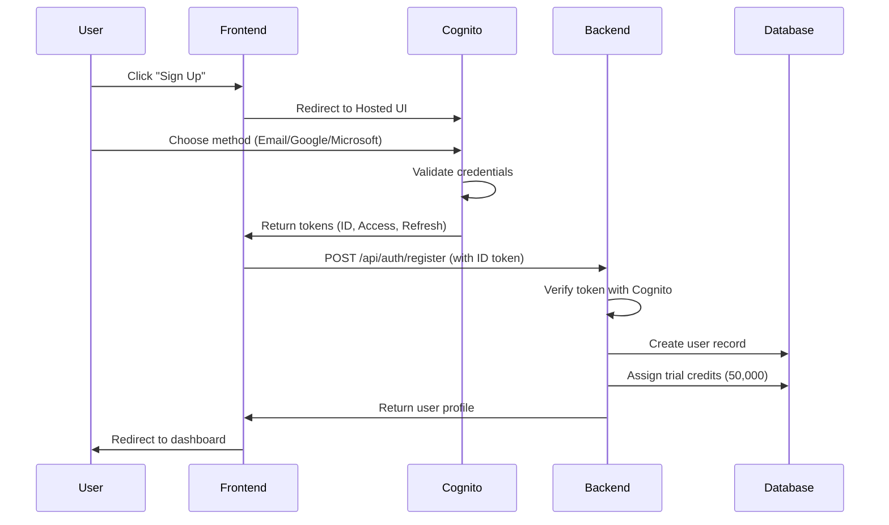
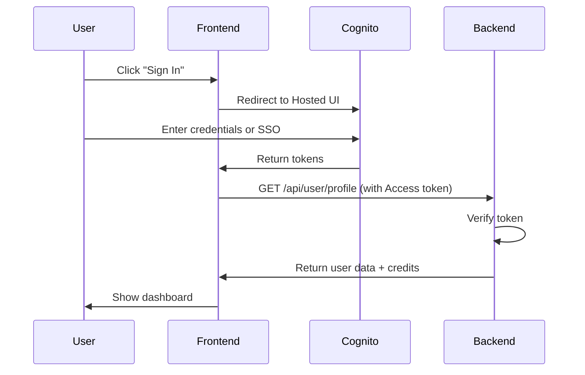
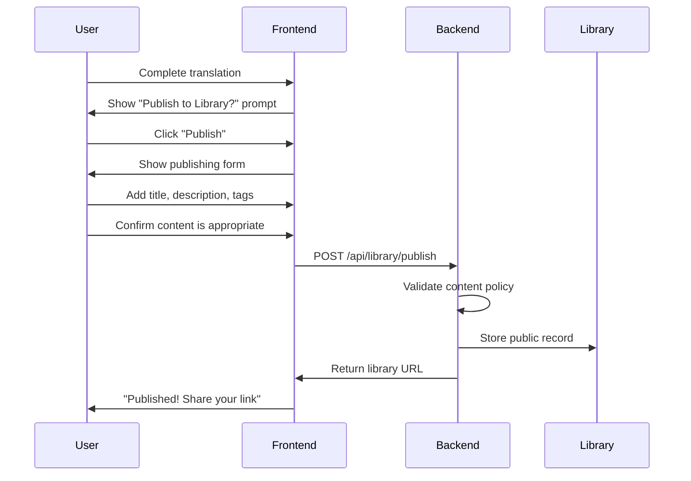

# Babel Stage-0: Foundation Architecture

> **Version**: 0.1.0  
> **Status**: Planning  
> **Last Updated**: December 24, 2024  
> **Authors**: LunarTech Development Team

---

## Executive Summary

Babel is a **document translation platform** that leverages Agentic OCR and Large Language Models to deliver accurate, structure-preserving translations. Stage-0 establishes the foundational infrastructure required to transform Babel from a prototype into a production-ready, scalable SaaS platform.

This document outlines the architecture, systems, and implementation roadmap for the following core pillars:

1. **Admin Dashboard** — Comprehensive administrative control center
2. **Authentication & Authorization** — AWS-powered identity management with SSO
3. **User Management** — Complete user lifecycle handling with compliance
4. **Credit System** — Usage-based billing and access control
5. **Public Library** — Community-driven translation repository
6. **Infrastructure** — AWS deployment architecture

---

## Table of Contents

1. [Vision & Philosophy](#vision--philosophy)
2. [Admin Dashboard](#1-admin-dashboard)
3. [Authentication System](#2-authentication-system)
4. [User Management](#3-user-management)
5. [Credit System](#4-credit-system)
6. [Public Library](#5-public-library)
7. [Infrastructure & Deployment](#6-infrastructure--deployment)
8. [Data Architecture](#7-data-architecture)
9. [Security & Compliance](#8-security--compliance)
10. [Future Roadmap](#9-future-roadmap)
11. [Technical Implementation Checklist](#10-technical-implementation-checklist)

---

## Vision & Philosophy

Babel exists at the **digital gold level** — unlocking access to knowledge repositories that were previously inaccessible due to language barriers. Every translated document represents a bridge to wisdom, education, and opportunity.

### Core Principles

| Principle | Description |
|-----------|-------------|
| **Knowledge Democratization** | Break language barriers to make global knowledge universally accessible |
| **Privacy-First** | Respect user data with GDPR and CCPA compliance baked in |
| **Scalable Excellence** | Architecture designed for growth from 100 to 1M users |
| **Operational Clarity** | Admin tools that provide complete visibility without chaos |

---

## 1. Admin Dashboard

The Admin Dashboard is the **command center** for Babel operations. It consolidates all operational metrics, user management, and compliance controls into a single, powerful interface.

### 1.1 Dashboard Overview (Home)

The main dashboard provides at-a-glance insights into platform health and activity.

#### Key Metrics Cards

| Metric | Description | Visualization |
|--------|-------------|---------------|
| **Total Users** | Cumulative registered users | Counter with trend arrow |
| **Active Users (DAU/MAU)** | Daily/Monthly active users | Sparkline chart |
| **Documents Translated** | Total documents processed (all-time) | Counter with daily delta |
| **Characters Processed** | Total characters translated | Counter in millions |
| **Revenue (MRR)** | Monthly recurring revenue | Currency with growth % |
| **Credit Usage Rate** | Platform-wide credit consumption | Percentage gauge |

#### Activity Charts

- **Signups Over Time**: Line chart showing daily/weekly/monthly new registrations
- **Translations Over Time**: Bar chart of documents translated per day
- **Language Pair Heatmap**: Most popular source → target language combinations
- **Peak Usage Hours**: Hourly activity distribution for capacity planning

#### Real-Time Activity Feed

```
[12:34:02] 🆕 New user: john.doe@email.com (Google SSO)
[12:33:45] 📄 Translation completed: user_id_123 | EN→FR | 5,432 chars
[12:33:12] 💳 Credit purchase: user_id_456 | Growth Plan | $149
[12:32:58] ⚠️ Rate limit hit: user_id_789 | 10 requests/min exceeded
```

---

### 1.2 Users Section

Complete user lifecycle management with compliance-aware features.

#### User List View

| Column | Description | Actions |
|--------|-------------|---------|
| **User ID** | Unique identifier | Copy to clipboard |
| **Email** | Primary contact | Click to view profile |
| **Name** | Display name | Editable |
| **Plan** | Current subscription tier | Badge (Free/Starter/Growth/Business/Enterprise) |
| **Credits** | Remaining balance | Progress bar |
| **Status** | Account state | Active / Suspended / Pending |
| **Joined** | Registration date | Sortable |
| **Last Active** | Most recent activity | Sortable |
| **Auth Method** | SSO provider | Google / Microsoft / Email |

#### Filters & Search

- Full-text search across email, name, user ID
- Filter by: Plan, Status, Auth Method, Join Date Range, Activity Date Range
- Bulk selection for mass actions

#### User Profile (Detail View)

```
┌─────────────────────────────────────────────────────────────┐
│  👤 John Doe                                    [Edit] [⋮]  │
│  john.doe@email.com                                         │
├─────────────────────────────────────────────────────────────┤
│  Plan: Growth ($149/mo)        Credits: 1,234,567 / 2,000,000│
│  Status: Active                Joined: Dec 15, 2024         │
│  Auth: Google SSO              Last Active: 2 hours ago     │
├─────────────────────────────────────────────────────────────┤
│  📊 Usage Statistics                                        │
│  ├── Documents Translated: 47                               │
│  ├── Characters Processed: 765,433                          │
│  ├── Favorite Language Pair: EN → DE                        │
│  └── Avg Document Size: 16,286 chars                        │
├─────────────────────────────────────────────────────────────┤
│  💳 Billing History                                         │
│  ├── Dec 2024: Growth Plan - $149 ✓                         │
│  └── Nov 2024: Trial (Free) - $0                            │
├─────────────────────────────────────────────────────────────┤
│  📄 Recent Translations                    [View All →]     │
│  ├── technical_manual.pdf | EN→DE | Dec 24, 2024            │
│  ├── research_paper.pdf | EN→FR | Dec 22, 2024              │
│  └── product_specs.docx | EN→ES | Dec 20, 2024              │
└─────────────────────────────────────────────────────────────┘
```

#### Admin Actions on Users

| Action | Description | Permission Level |
|--------|-------------|------------------|
| **View Profile** | See all user details | Admin |
| **Edit User** | Modify name, email, metadata | Admin |
| **Adjust Credits** | Add/remove credits manually | Admin |
| **Change Plan** | Upgrade/downgrade subscription | Admin |
| **Suspend User** | Temporarily disable account | Admin |
| **Export Data** | GDPR data export request | Admin |
| **Delete User** | Permanent removal (with data purge options) | Super Admin |
| **Impersonate** | Login as user for debugging (logged & time-limited) | Super Admin |
| **Access Content** | View user documents for compliance (logged) | Super Admin |
| **Platform Settings** | Modify global configuration | Super Admin |
| **View Abuse Reports** | Access abuse detection dashboard | Super Admin |

---

### 1.2.1 Admin Role Hierarchy

Babel implements a **two-tier admin system** that balances operational efficiency with privacy protection and abuse prevention.

#### Role Definitions

| Role | Description | Access Scope |
|------|-------------|-------------|
| **Admin** | Standard operational staff | User management, support, analytics (metadata only) |
| **Super Admin** | Senior staff with elevated privileges | Full system access, content review, platform configuration |

#### Super Admin Powers & Responsibilities

Super Admins have elevated access specifically designed to **prevent platform abuse** while **respecting privacy laws**:

```
┌─────────────────────────────────────────────────────────────────────────┐
│                    SUPER ADMIN CAPABILITIES                             │
├─────────────────────────────────────────────────────────────────────────┤
│                                                                         │
│  🛡️ ABUSE PREVENTION (Privacy-Compliant)                               │
│  ├── View aggregated abuse metrics (not individual content)            │
│  ├── Access flagged content ONLY after automated detection triggers    │
│  ├── Review accounts flagged by abuse detection algorithms             │
│  └── Terminate accounts violating Terms of Service                     │
│                                                                         │
│  📋 COMPLIANCE ACCESS (Lawful Basis Required)                          │
│  ├── Access content ONLY with documented legal justification           │
│  ├── All access logged with reason, timestamp, reviewer ID             │
│  ├── Automatic audit trail sent to compliance team                     │
│  └── Periodic access reviews by legal/compliance                       │
│                                                                         │
│  ⚙️ PLATFORM ADMINISTRATION                                            │
│  ├── Modify credit policies and pricing                                │
│  ├── Enable/disable language pairs                                     │
│  ├── Configure rate limits and security settings                       │
│  └── Manage Admin accounts                                             │
│                                                                         │
└─────────────────────────────────────────────────────────────────────────┘
```

#### Privacy-Compliant Abuse Detection

To ensure Super Admins can prevent abuse **without** violating user privacy:

| Detection Layer | Method | Privacy Impact |
|-----------------|--------|----------------|
| **Automated Scanning** | ML-based content classification | No human views content |
| **Volume Anomalies** | Unusual translation patterns | Metadata only |
| **Rate Limiting** | Excessive API calls | No content access |
| **User Reports** | Community flagging | Reported content only |
| **Payment Fraud** | Chargeback patterns | Billing data only |

**When automated systems flag content:**
1. Super Admin receives alert with **metadata only** (file size, language pair, timestamp)
2. If review required, Super Admin must enter **legal justification**
3. All access is **logged and auditable**
4. User is notified of review (unless legal/safety exception applies)

---

### 1.3 Translations Section (Compliance Viewer)

Access to translation records for compliance, quality assurance, and support purposes.

> **⚠️ Privacy Notice**: Access to user translations is logged and subject to audit. All access must comply with GDPR Article 6 (lawful basis) and CCPA requirements.

#### Translation Record View

| Field | Description |
|-------|-------------|
| **Translation ID** | Unique identifier |
| **User** | Owner of the document |
| **Source File** | Original filename (not stored — only metadata) |
| **Language Pair** | Source → Target |
| **Character Count** | Size of translation |
| **Created At** | Timestamp |
| **Status** | Completed / Failed / Processing |
| **Public** | Whether user published to library |

#### Compliance Access Controls

```
┌─────────────────────────────────────────────────────────────┐
│  🔒 Access Translation Content                              │
├─────────────────────────────────────────────────────────────┤
│  Translation ID: tr_abc123xyz                               │
│  User: john.doe@email.com                                   │
│                                                             │
│  ⚠️ You are about to access user content. This action      │
│  will be logged and may require justification.              │
│                                                             │
│  Reason for Access: [________________________]              │
│                                                             │
│  ☐ Legal/Compliance Request                                 │
│  ☐ User Support Ticket (attach ticket ID)                   │
│  ☐ Quality Assurance Review                                 │
│  ☐ Security Investigation                                   │
│                                                             │
│  [Cancel]                            [Access with Logging]  │
└─────────────────────────────────────────────────────────────┘
```

#### What Admins Can See

| Data Type | Admin Access | Super Admin Access | Retention |
|-----------|--------------|--------------------|-----------|
| **Translation Metadata** | ✅ Always | ✅ Always | Indefinite |
| **Source Document** | ❌ Never | ⚠️ With justification + logging | 90 days (then purged) |
| **Translated Output** | ❌ Never | ⚠️ With justification + logging | 90 days (then purged) |
| **User Notes/Tags** | ✅ Always | ✅ Always | User-controlled |
| **Flagged Content** | ❌ Never | ✅ For abuse review | Until resolved |

> **📌 90-Day Retention Policy**: Documents are retained for 90 days to enable abuse investigation while limiting long-term data exposure. This extended window allows Super Admins to investigate flagged accounts and prevents bad actors from quickly cycling through trial accounts to abuse the platform.

---

### 1.4 Analytics Section

Deep-dive analytics for business intelligence.

#### Reports Available

1. **User Growth Report**
   - New signups by day/week/month
   - Churn rate and retention curves
   - Signup source attribution

2. **Translation Volume Report**
   - Documents and characters over time
   - Breakdown by language pair
   - Average document size trends

3. **Revenue Report**
   - MRR, ARR projections
   - Revenue by plan tier
   - Credit purchase frequency

4. **Language Popularity Report**
   - Most requested language pairs
   - Underserved language opportunities
   - Regional usage patterns

5. **System Health Report**
   - API response times
   - Error rates by endpoint
   - Queue depth and processing times

---

### 1.5 Settings Section

Platform-wide configuration.

#### Configurable Options

| Setting | Description | Default |
|---------|-------------|---------|
| **Free Trial Credits** | Credits given to new users | 50,000 |
| **Rate Limits** | API calls per minute per user | 10 |
| **Max Document Size** | Maximum uploadable file size | 50MB |
| **Supported Languages** | Enable/disable language pairs | All 22 |
| **Maintenance Mode** | Disable user access temporarily | Off |
| **Terms of Service URL** | Link to current ToS | /terms |
| **Privacy Policy URL** | Link to privacy policy | /privacy |

---

### 1.6 Audit Logs

Complete audit trail for compliance and security.

```
[2024-12-24 12:34:56] ADMIN_LOGIN | admin@lunartech.com | IP: 192.168.1.1
[2024-12-24 12:35:12] USER_VIEW | admin@lunartech.com | target: user_123
[2024-12-24 12:36:45] CREDIT_ADJUST | admin@lunartech.com | user_123 | +10000
[2024-12-24 12:40:01] CONTENT_ACCESS | admin@lunartech.com | tr_abc123 | Reason: Support Ticket #456
```

---

## 2. Authentication System

### 2.1 AWS Cognito Integration

We will use **AWS Cognito** as our identity provider, offering:

- Managed user pools
- Built-in SSO federation
- MFA support
- Security best practices (password policies, brute-force protection)

#### Architecture

```
┌─────────────┐     ┌─────────────────┐     ┌─────────────────┐
│   Frontend  │────▶│  AWS Cognito    │────▶│  User Pool      │
│  (React/JS) │     │  Hosted UI      │     │  (User Store)   │
└─────────────┘     └─────────────────┘     └─────────────────┘
                            │
                            ▼
                    ┌───────────────────────────────────┐
                    │       Identity Providers          │
                    │  ┌─────────┐    ┌─────────────┐   │
                    │  │ Google  │    │ Microsoft   │   │
                    │  └─────────┘    └─────────────┘   │
                    └───────────────────────────────────┘
```

### 2.2 Authentication Flows

#### Sign Up Flow



#### Sign In Flow



### 2.3 Supported Identity Providers

| Provider | OAuth Scopes | User Data Retrieved |
|----------|-------------|---------------------|
| **Email/Password** | N/A | Email, Name (user-provided) |
| **Google** | email, profile, openid | Email, Name, Avatar |
| **Microsoft** | email, profile, openid, User.Read | Email, Name, Avatar |

### 2.4 Token Management

| Token Type | Lifetime | Storage | Usage |
|------------|----------|---------|-------|
| **ID Token** | 1 hour | Memory only | User info display |
| **Access Token** | 1 hour | Memory only | API authorization |
| **Refresh Token** | 30 days | Secure HTTP-only cookie | Silent token refresh |

### 2.5 Password & Security Policies

| Policy | Requirement |
|--------|-------------|
| **Minimum Length** | 8 characters |
| **Character Requirements** | Uppercase, lowercase, number, special |
| **MFA** | Optional (TOTP recommended) |
| **Account Lockout** | 5 failed attempts → 30 min lockout |
| **Password Reset** | Email verification required |

---

## 3. User Management

### 3.1 User Data Model

```python
class User:
    # Identity
    id: UUID                      # Internal unique ID
    cognito_sub: str              # AWS Cognito subject ID
    email: str                    # Primary email (verified)
    name: str                     # Display name
    avatar_url: Optional[str]     # Profile picture URL
    
    # Authentication
    auth_provider: Enum           # EMAIL, GOOGLE, MICROSOFT
    email_verified: bool          # Email verification status
    mfa_enabled: bool             # Two-factor auth status
    
    # Subscription
    plan: Enum                    # FREE, STARTER, GROWTH, BUSINESS, ENTERPRISE
    credits_balance: int          # Current credit balance
    credits_used_total: int       # Lifetime credits consumed
    subscription_start: datetime  # Current billing period start
    subscription_end: datetime    # Current billing period end
    
    # Metadata
    created_at: datetime          # Account creation timestamp
    updated_at: datetime          # Last profile update
    last_login_at: datetime       # Most recent login
    last_activity_at: datetime    # Most recent API call
    
    # Status
    status: Enum                  # ACTIVE, SUSPENDED, PENDING_DELETION
    suspension_reason: Optional[str]
    deletion_requested_at: Optional[datetime]
    
    # Preferences
    preferred_source_lang: str    # Default source language
    preferred_target_lang: str    # Default target language
    ui_theme: Enum                # LIGHT, DARK, SYSTEM
    email_notifications: bool     # Marketing emails opt-in
```

### 3.2 User Lifecycle

```
┌──────────┐    ┌──────────┐    ┌──────────┐    ┌──────────┐
│  Guest   │───▶│ Pending  │───▶│  Active  │───▶│ Churned  │
└──────────┘    └──────────┘    └──────────┘    └──────────┘
                     │               │               │
                     │               ▼               │
                     │         ┌──────────┐          │
                     │         │Suspended │          │
                     │         └──────────┘          │
                     │               │               │
                     ▼               ▼               ▼
                ┌────────────────────────────────────────┐
                │              Deleted                   │
                └────────────────────────────────────────┘
```

---

## 4. Credit System

### 4.1 Credit Philosophy

Credits provide a **transparent, fair, and flexible** usage model:

- 1 Credit ≈ 10 characters translated
- Users only pay for what they use
- Unused credits roll over within billing period
- Clear visibility into consumption

### 4.2 Pricing Tiers

| Tier | Monthly Price | Credits | Est. Documents | Credit/$ |
|------|---------------|---------|----------------|----------|
| **Free Trial** | $0 | 50,000 | ~10 docs | N/A |
| **Starter** | $49 | 500,000 | ~100 docs | 10,204 |
| **Growth** | $149 | 2,000,000 | ~400 docs | 13,423 |
| **Business** | $499 | 8,000,000 | ~1,600 docs | 16,032 |
| **Enterprise** | Custom | Custom | Unlimited | Negotiated |

### 4.2.1 Payment Providers

Babel supports **two payment processors** to maximize conversion and accommodate user preferences:

| Provider | Use Cases | Regions |
|----------|-----------|---------|
| **Stripe** | Credit/debit cards, subscriptions, invoicing | Global |
| **PayPal** | PayPal balance, bank transfers, buyer protection | Global |

#### Payment Flow Architecture

```
┌─────────────────────────────────────────────────────────────────────────┐
│                          PAYMENT FLOW                                   │
├─────────────────────────────────────────────────────────────────────────┤
│                                                                         │
│  User selects plan                                                      │
│       │                                                                 │
│       ▼                                                                 │
│  ┌─────────────────────────────────────────────────────────────────┐    │
│  │              Choose Payment Method                               │    │
│  │  ┌─────────────────────┐    ┌─────────────────────────────────┐  │    │
│  │  │  💳 Credit Card     │    │  🔵 PayPal                      │  │    │
│  │  │  (Powered by Stripe)│    │  (Redirect to PayPal)           │  │    │
│  │  └─────────────────────┘    └─────────────────────────────────┘  │    │
│  └─────────────────────────────────────────────────────────────────┘    │
│                    │                           │                        │
│                    ▼                           ▼                        │
│  ┌─────────────────────────────┐    ┌─────────────────────────────┐    │
│  │  Stripe Checkout Session   │    │  PayPal Order + Approval    │    │
│  │  - Card validation         │    │  - PayPal login             │    │
│  │  - 3D Secure if required   │    │  - Payment confirmation     │    │
│  │  - Fraud detection         │    │  - Return to Babel          │    │
│  └─────────────────────────────┘    └─────────────────────────────┘    │
│                    │                           │                        │
│                    └───────────┬───────────────┘                        │
│                                ▼                                        │
│                  ┌─────────────────────────────┐                        │
│                  │  Webhook → Backend          │                        │
│                  │  - Verify payment           │                        │
│                  │  - Credit user account      │                        │
│                  │  - Send receipt email       │                        │
│                  └─────────────────────────────┘                        │
│                                                                         │
└─────────────────────────────────────────────────────────────────────────┘
```

#### Subscription Management

| Feature | Stripe | PayPal |
|---------|--------|--------|
| **Recurring Billing** | ✅ Built-in | ✅ Billing Agreements |
| **Auto-Renewal** | ✅ Monthly | ✅ Monthly |
| **Failed Payment Retry** | ✅ Smart Retries | ✅ Automatic |
| **Cancel Anytime** | ✅ Immediate | ✅ Immediate |
| **Plan Upgrades** | ✅ Prorated | ✅ Prorated |
| **Refunds** | ✅ Partial/Full | ✅ Partial/Full |
| **Invoices** | ✅ Auto-generated | ✅ Auto-generated |

#### Fraud Prevention

| Protection | Method |
|------------|--------|
| **Stripe Radar** | ML-based fraud scoring |
| **3D Secure** | Bank verification for high-risk cards |
| **PayPal Buyer Protection** | Dispute resolution |
| **Velocity Checks** | Block rapid account creation + purchase |
| **Chargeback Monitoring** | Flag accounts with disputes |

### 4.3 Credit Consumption Rules

| Operation | Credit Cost |
|-----------|-------------|
| **Translation** | 1 credit per 10 characters (source text) |
| **Re-translation** | Full cost (no discounts) |
| **Preview** | Free |
| **Download** | Free (already paid during translation) |

### 4.4 Credit Lifecycle

```python
class CreditTransaction:
    id: UUID
    user_id: UUID
    type: Enum                    # PURCHASE, CONSUMPTION, ADJUSTMENT, REFUND
    amount: int                   # Positive = credit, Negative = debit
    balance_after: int            # Running balance
    description: str              # Human-readable reason
    reference_id: Optional[str]   # Related entity (translation_id, invoice_id)
    created_at: datetime
    created_by: Optional[UUID]    # Admin ID if manual adjustment
```

### 4.5 Low Credit Warnings

| Threshold | Action |
|-----------|--------|
| 20% remaining | In-app warning banner |
| 10% remaining | Email notification |
| 5% remaining | Persistent warning + upgrade prompt |
| 0% remaining | Block new translations, allow downloads |

---

## 5. Public Library

### 5.1 Concept

The Public Library allows users to **share their translations** with the community, creating a crowdsourced repository of translated documents.

### 5.2 Publishing Flow



### 5.3 Library Entry Model

```python
class LibraryEntry:
    id: UUID
    user_id: UUID                 # Publisher
    translation_id: UUID          # Original translation reference
    
    # Metadata
    title: str                    # User-provided title
    description: str              # Brief description
    tags: List[str]               # Searchable tags
    source_language: str
    target_language: str
    page_count: int
    character_count: int
    
    # Engagement
    view_count: int
    download_count: int
    like_count: int
    
    # Moderation
    status: Enum                  # PENDING_REVIEW, PUBLISHED, REMOVED
    moderation_notes: Optional[str]
    
    # Timestamps
    published_at: datetime
    updated_at: datetime
```

### 5.4 Library Features

| Feature | Description |
|---------|-------------|
| **Search** | Full-text search across titles, descriptions, tags |
| **Filter** | By language pair, date, popularity |
| **Sort** | Most recent, most popular, most downloaded |
| **Preview** | First page preview before download |
| **Download** | Free for all users (no credits required) |
| **Report** | Flag inappropriate content |

---

## 6. Infrastructure & Deployment

### 6.1 AWS Architecture

```
┌─────────────────────────────────────────────────────────────────────────┐
│                              AWS Cloud                                  │
│                                                                         │
│  ┌──────────────┐    ┌──────────────┐    ┌──────────────────────────┐   │
│  │ CloudFront   │───▶│    S3        │    │     Route 53             │   │
│  │ (CDN)        │    │ (Static)     │    │     (DNS)                │   │
│  └──────────────┘    └──────────────┘    └──────────────────────────┘   │
│         │                                           │                   │
│         ▼                                           ▼                   │
│  ┌──────────────────────────────────────────────────────────────────┐   │
│  │                    Application Load Balancer                      │   │
│  └──────────────────────────────────────────────────────────────────┘   │
│         │                                                               │
│         ▼                                                               │
│  ┌──────────────────────────────────────────────────────────────────┐   │
│  │                         ECS Fargate                               │   │
│  │  ┌─────────────┐  ┌─────────────┐  ┌─────────────────────────┐    │   │
│  │  │ API Service │  │ Worker Svc  │  │ Admin Service           │    │   │
│  │  │ (FastAPI)   │  │ (BabelDOC)  │  │ (FastAPI)               │    │   │
│  │  └─────────────┘  └─────────────┘  └─────────────────────────┘    │   │
│  └──────────────────────────────────────────────────────────────────┘   │
│         │                   │                                           │
│         ▼                   ▼                                           │
│  ┌──────────────┐    ┌──────────────┐    ┌──────────────────────────┐   │
│  │   RDS        │    │    SQS       │    │     Cognito              │   │
│  │ (PostgreSQL) │    │  (Queues)    │    │   (Auth)                 │   │
│  └──────────────┘    └──────────────┘    └──────────────────────────┘   │
│         │                                                               │
│         ▼                                                               │
│  ┌──────────────┐    ┌──────────────┐                                   │
│  │    S3        │    │ CloudWatch   │                                   │
│  │ (Documents)  │    │ (Logs/Metrics│                                   │
│  └──────────────┘    └──────────────┘                                   │
│                                                                         │
└─────────────────────────────────────────────────────────────────────────┘
```

### 6.2 AWS Services Breakdown

| Service | Purpose | Configuration |
|---------|---------|---------------|
| **Cognito** | User authentication & SSO | User Pool with Google/Microsoft federation |
| **S3 (Static)** | Frontend hosting | CloudFront distribution |
| **S3 (Documents)** | Document storage | Server-side encryption, lifecycle policies |
| **ECS Fargate** | Container orchestration | Auto-scaling, spot instances |
| **RDS PostgreSQL** | Primary database | Multi-AZ, automated backups |
| **SQS** | Job queue | FIFO queue for translation jobs |
| **CloudWatch** | Monitoring & logging | Custom dashboards, alarms |
| **Route 53** | DNS management | Health checks, failover |
| **CloudFront** | CDN | Edge caching, SSL termination |
| **WAF** | Web firewall | Rate limiting, SQL injection protection |

### 6.3 Environment Configuration

| Environment | Purpose | Scale |
|-------------|---------|-------|
| **Development** | Local development | Single container |
| **Staging** | Pre-production testing | Minimal AWS resources |
| **Production** | Live system | Full redundancy, auto-scaling |

---

## 7. Data Architecture

### 7.1 Database Schema Overview

```
┌─────────────────────────────────────────────────────────────────┐
│                         PostgreSQL                              │
├─────────────────────────────────────────────────────────────────┤
│                                                                 │
│  ┌──────────┐    ┌──────────────┐    ┌───────────────────────┐  │
│  │  users   │───▶│ translations │───▶│   library_entries     │  │
│  └──────────┘    └──────────────┘    └───────────────────────┘  │
│       │                │                                        │
│       ▼                ▼                                        │
│  ┌──────────┐    ┌──────────────┐                               │
│  │ credits  │    │  documents   │                               │
│  └──────────┘    └──────────────┘                               │
│       │                                                         │
│       ▼                                                         │
│  ┌────────────────────┐    ┌─────────────────────────────────┐  │
│  │ subscriptions      │    │         audit_logs              │  │
│  └────────────────────┘    └─────────────────────────────────┘  │
│                                                                 │
└─────────────────────────────────────────────────────────────────┘
```

### 7.2 Document Storage Strategy

| Data Type | Storage Location | Encryption | Retention | Rationale |
|-----------|------------------|------------|-----------|----------|
| **User Data** | RDS PostgreSQL | AES-256 at rest | Account lifetime | Core identity |
| **Source Documents** | S3 (encrypted) | AES-256 + KMS | 90 days | Abuse prevention |
| **Translated Documents** | S3 (encrypted) | AES-256 + KMS | 90 days | Abuse prevention |
| **Library Documents** | S3 (encrypted) | AES-256 + KMS | Indefinite | Public resource |
| **Audit Logs** | CloudWatch + S3 | Encrypted | 7 years | Compliance |
| **Abuse Flags** | RDS PostgreSQL | AES-256 at rest | 2 years | Pattern detection |

> **⚠️ Anti-Abuse Retention**: The 90-day retention period for documents serves a critical security function. It allows Super Admins to investigate accounts flagged for abuse (e.g., translating illegal content, copyright violations, or terms of service violations) before evidence is automatically purged. This is lawful under GDPR Article 6(1)(f) — legitimate interest in preventing platform misuse.

---

## 8. Security & Compliance

### 8.1 GDPR Compliance (EU)

| Requirement | Implementation |
|-------------|----------------|
| **Right to Access** | User can export all data via dashboard |
| **Right to Rectification** | User can edit profile information |
| **Right to Erasure** | User can request account deletion |
| **Data Portability** | JSON/CSV export of user data |
| **Consent** | Explicit opt-in for marketing emails |
| **Data Minimization** | Only collect necessary data |
| **Breach Notification** | Automated alerting + process in place |

### 8.2 CCPA Compliance (California)

| Requirement | Implementation |
|-------------|----------------|
| **Right to Know** | Transparent data collection disclosure |
| **Right to Delete** | Account deletion with data purge |
| **Right to Opt-Out** | No selling of personal data |
| **Non-Discrimination** | Equal service regardless of privacy choices |

### 8.3 Security Measures

| Layer | Protection |
|-------|------------|
| **Network** | VPC, Security Groups, WAF |
| **Transport** | TLS 1.3 everywhere |
| **Application** | Input validation, CSRF protection, rate limiting |
| **Data** | Encryption at rest, KMS key management |
| **Access** | IAM roles, least-privilege principle |
| **Monitoring** | CloudTrail, GuardDuty, Security Hub |

---

## 9. Future Roadmap

### Stage-1: Babel Core (Current)
- Standard document translation
- PDF and DOCX support
- 22 language pairs

### Stage-2: Babel-Extreme
- Enhanced translation quality
- Domain-specific models (legal, medical, technical)
- Terminology glossaries

### Stage-3: Babel-Full
- **Handwriting recognition**
- Scanned document support
- Historical document digitization
- Manuscript translation

### Stage-4: Babel-Enterprise
- On-premises deployment option
- Custom model fine-tuning
- Dedicated infrastructure
- SLA guarantees

---

## 10. Technical Implementation Checklist

> **⚡ Accelerated Timeline**: With **Antigravity AI-assisted development**, we compress the traditional 14-week timeline into **7 days** of intensive, focused sprints.

### Day 1: Foundation & Authentication

#### AWS Infrastructure Setup
- [ ] Set up AWS Cognito User Pool
- [ ] Configure Google OAuth integration
- [ ] Configure Microsoft OAuth integration
- [ ] Set up RDS PostgreSQL instance
- [ ] Set up S3 buckets (static, documents)
- [ ] Configure basic CloudFront distribution

#### Authentication Flows
- [ ] Implement sign-up flow (frontend + backend)
- [ ] Implement sign-in flow
- [ ] Implement password reset flow
- [ ] Implement token refresh mechanism

---

### Day 2: Database & User Management

#### Database Schema
- [ ] Design and implement complete database schema
- [ ] Create user table with all fields
- [ ] Create translations table
- [ ] Create credit_transactions table
- [ ] Create subscriptions table
- [ ] Create audit_logs table

#### User APIs
- [ ] Build user profile API endpoints
- [ ] Implement user preferences
- [ ] Create user data export (GDPR)

---

### Day 3: Credit System & Billing

#### Credit Engine
- [ ] Implement credit balance tracking
- [ ] Build credit transaction logging
- [ ] Create credit deduction on translation
- [ ] Build low-credit warning system
- [ ] Implement subscription tier logic

#### Payment Integration
- [ ] Integrate Stripe checkout
- [ ] Integrate PayPal checkout
- [ ] Set up webhook handlers
- [ ] Implement subscription management
- [ ] Build invoice generation

---

### Day 4: Admin Dashboard - Core

#### Admin Authentication
- [ ] Build admin authentication (separate pool)
- [ ] Implement Admin/Super Admin role system
- [ ] Create role-based access controls

#### Dashboard Views
- [ ] Create dashboard overview page with metrics
- [ ] Build user list view with search/filter
- [ ] Create user detail view
- [ ] Implement user management actions

---

### Day 5: Admin Dashboard - Advanced

#### Compliance & Analytics
- [ ] Build translation compliance viewer
- [ ] Implement justification-required access for Super Admins
- [ ] Create analytics dashboards
- [ ] Implement audit logging
- [ ] Build settings management

#### Abuse Prevention
- [ ] Implement abuse detection triggers
- [ ] Build flagged content review interface
- [ ] Create account suspension workflow

---

### Day 6: Public Library

#### Library Backend
- [ ] Design library database schema
- [ ] Build publishing flow
- [ ] Implement content moderation queue

#### Library Frontend
- [ ] Create library browse interface
- [ ] Implement search functionality
- [ ] Build content reporting mechanism

---

### Day 7: Integration, Testing & Launch

#### System Integration
- [ ] Connect all services end-to-end
- [ ] Configure ECS Fargate cluster
- [ ] Set up SQS queues for job processing
- [ ] Configure CloudWatch logging and alarms

#### Quality Assurance
- [ ] Security audit (automated + manual review)
- [ ] Performance optimization
- [ ] Documentation completion
- [ ] End-to-end user flow testing

#### Deployment
- [ ] Deploy to staging environment
- [ ] Final validation
- [ ] Production deployment
- [ ] Staged rollout to users

---

### Why 7 Days Works

| Traditional | With Antigravity |
|-------------|-----------------|
| Manual boilerplate coding | AI generates scaffolding instantly |
| Research + trial/error | AI provides working patterns immediately |
| Sequential development | Parallel generation of components |
| Debug cycles | AI-assisted rapid debugging |
| Documentation after coding | Docs generated alongside code |

> **Note**: This timeline assumes dedicated full-time focus and leverages Antigravity for code generation, debugging, and documentation. Human oversight remains critical for architecture decisions, security review, and quality assurance.

---

## Appendix A: API Endpoints Overview

### Authentication
```
POST   /api/auth/register          # Complete registration after Cognito
POST   /api/auth/refresh           # Refresh tokens
POST   /api/auth/logout            # Invalidate session
```

### User
```
GET    /api/user/profile           # Get current user
PATCH  /api/user/profile           # Update profile
DELETE /api/user/account           # Request deletion
GET    /api/user/credits           # Get credit balance
GET    /api/user/transactions      # Get credit history
```

### Translation
```
POST   /api/translate              # Start translation job
GET    /api/translate/:id          # Get job status
GET    /api/translate/:id/download # Download result
GET    /api/translations           # List user's translations
```

### Library
```
GET    /api/library                # Browse public translations
GET    /api/library/:id            # Get library entry
POST   /api/library                # Publish to library
DELETE /api/library/:id            # Unpublish (owner only)
POST   /api/library/:id/report     # Report content
```

### Admin
```
GET    /api/admin/dashboard        # Dashboard metrics
GET    /api/admin/users            # List users
GET    /api/admin/users/:id        # User details
PATCH  /api/admin/users/:id        # Update user
POST   /api/admin/users/:id/credits # Adjust credits
GET    /api/admin/translations     # List all translations
GET    /api/admin/audit-logs       # View audit logs
```

---

## Appendix B: Terminology Updates

As Babel evolves from a handbook-focused tool to a general document translation platform, the following terminology changes apply:

| Old Term | New Term |
|----------|----------|
| Handbook | Document |
| Book | Document |
| Manual | Document |
| Handbook Translation | Document Translation |

---

> **Document Status**: Draft  
> **Next Review**: After stakeholder feedback  
> **Prepared by**: LunarTech Development Team
