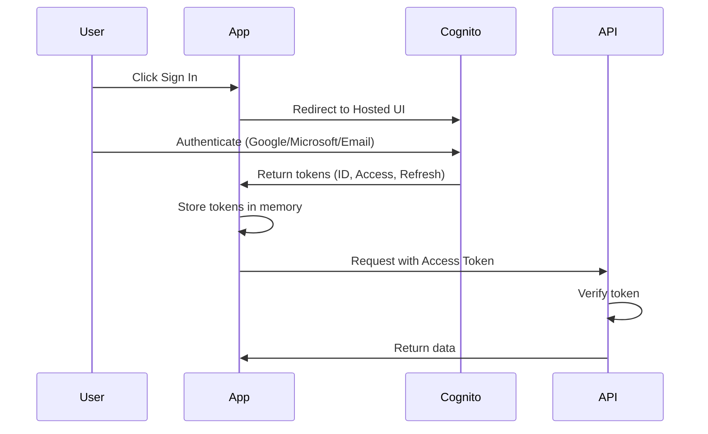
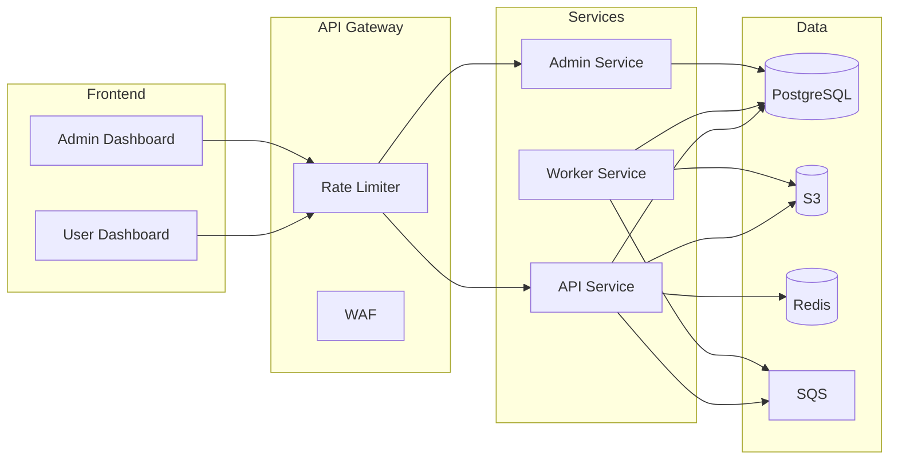
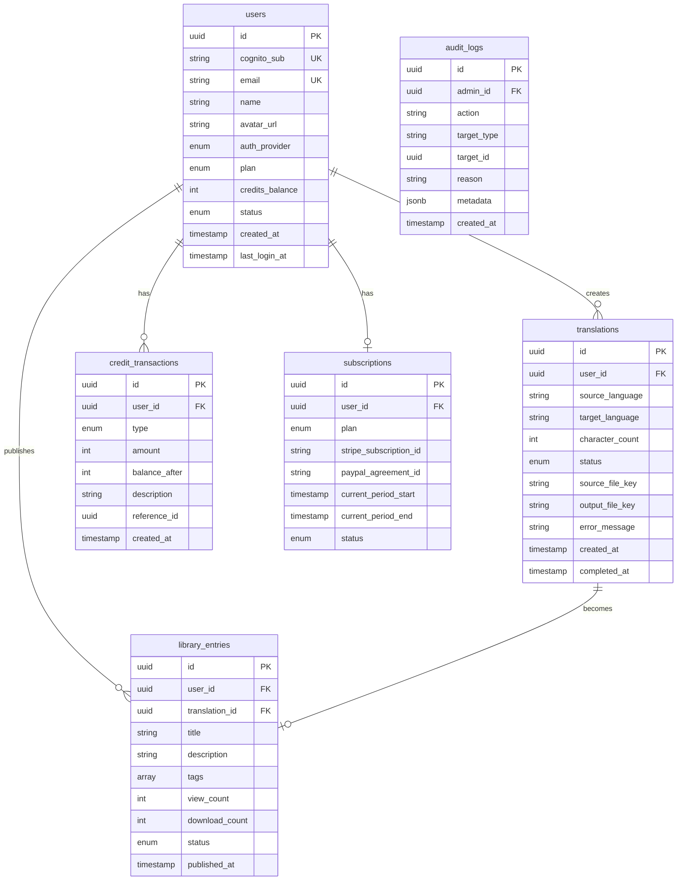

# Babel System Architecture

> **Version**: 1.0.0  
> **Last Updated**: December 24, 2024  
> **Status**: Stage-0 Design

---

## Overview

Babel is a **document translation platform** that combines Agentic OCR with Large Language Models to deliver accurate, structure-preserving translations. This document provides the complete technical architecture.

```
┌─────────────────────────────────────────────────────────────────────────────┐
│                            BABEL PLATFORM                                   │
├─────────────────────────────────────────────────────────────────────────────┤
│                                                                             │
│   ┌─────────────┐    ┌─────────────┐    ┌─────────────┐    ┌─────────────┐  │
│   │   Users     │    │   Admins    │    │  Library    │    │   API       │  │
│   │  Dashboard  │    │  Dashboard  │    │  Browser    │    │  Clients    │  │
│   └──────┬──────┘    └──────┬──────┘    └──────┬──────┘    └──────┬──────┘  │
│          │                  │                  │                  │         │
│          └──────────────────┴──────────────────┴──────────────────┘         │
│                                    │                                        │
│                                    ▼                                        │
│   ┌─────────────────────────────────────────────────────────────────────┐   │
│   │                        API GATEWAY                                   │   │
│   │                   (AWS API Gateway + WAF)                            │   │
│   └─────────────────────────────────────────────────────────────────────┘   │
│                                    │                                        │
│          ┌─────────────────────────┼─────────────────────────┐              │
│          ▼                         ▼                         ▼              │
│   ┌─────────────┐          ┌─────────────┐          ┌─────────────┐         │
│   │   Auth      │          │   Core      │          │   Admin     │         │
│   │  Service    │          │   API       │          │   API       │         │
│   └─────────────┘          └─────────────┘          └─────────────┘         │
│          │                         │                         │              │
│          └─────────────────────────┼─────────────────────────┘              │
│                                    ▼                                        │
│   ┌─────────────────────────────────────────────────────────────────────┐   │
│   │                    TRANSLATION ENGINE                                │   │
│   │                       (BabelDOC)                                     │   │
│   └─────────────────────────────────────────────────────────────────────┘   │
│                                                                             │
└─────────────────────────────────────────────────────────────────────────────┘
```

---

## Table of Contents

1. [High-Level Architecture](#1-high-level-architecture)
2. [Frontend Architecture](#2-frontend-architecture)
3. [Backend Services](#3-backend-services)
4. [Translation Engine](#4-translation-engine)
5. [Data Layer](#5-data-layer)
6. [Authentication & Authorization](#6-authentication--authorization)
7. [Infrastructure](#7-infrastructure)
8. [API Design](#8-api-design)
9. [Security Architecture](#9-security-architecture)
10. [Monitoring & Observability](#10-monitoring--observability)

---

## 1. High-Level Architecture

### 1.1 System Layers

```
┌─────────────────────────────────────────────────────────────────────────┐
│                         PRESENTATION LAYER                              │
│  ┌─────────────┐  ┌─────────────┐  ┌─────────────┐  ┌─────────────┐     │
│  │ User Web    │  │ Admin Web   │  │ Library     │  │ Mobile      │     │
│  │ Dashboard   │  │ Dashboard   │  │ Portal      │  │ (Future)    │     │
│  └─────────────┘  └─────────────┘  └─────────────┘  └─────────────┘     │
├─────────────────────────────────────────────────────────────────────────┤
│                           API LAYER                                     │
│  ┌─────────────────────────────────────────────────────────────────┐    │
│  │                    AWS API Gateway                               │    │
│  │              (Rate Limiting, WAF, SSL Termination)               │    │
│  └─────────────────────────────────────────────────────────────────┘    │
├─────────────────────────────────────────────────────────────────────────┤
│                         SERVICE LAYER                                   │
│  ┌───────────┐ ┌───────────┐ ┌───────────┐ ┌───────────┐ ┌───────────┐  │
│  │   Auth    │ │   User    │ │Translation│ │  Credit   │ │  Library  │  │
│  │  Service  │ │  Service  │ │  Service  │ │  Service  │ │  Service  │  │
│  └───────────┘ └───────────┘ └───────────┘ └───────────┘ └───────────┘  │
│  ┌───────────┐ ┌───────────┐ ┌───────────┐                              │
│  │   Admin   │ │  Billing  │ │  Audit    │                              │
│  │  Service  │ │  Service  │ │  Service  │                              │
│  └───────────┘ └───────────┘ └───────────┘                              │
├─────────────────────────────────────────────────────────────────────────┤
│                        PROCESSING LAYER                                 │
│  ┌─────────────────────────────────────────────────────────────────┐    │
│  │                    BabelDOC Engine                               │    │
│  │  ┌─────────┐ ┌─────────┐ ┌─────────┐ ┌─────────┐ ┌─────────┐     │    │
│  │  │ Parser  │→│ OCR     │→│ Extract │→│Translate│→│ Rebuild │     │    │
│  │  └─────────┘ └─────────┘ └─────────┘ └─────────┘ └─────────┘     │    │
│  └─────────────────────────────────────────────────────────────────┘    │
├─────────────────────────────────────────────────────────────────────────┤
│                          DATA LAYER                                     │
│  ┌───────────┐ ┌───────────┐ ┌───────────┐ ┌───────────┐                │
│  │PostgreSQL │ │    S3     │ │   Redis   │ │CloudWatch │                │
│  │ (Primary) │ │(Documents)│ │  (Cache)  │ │  (Logs)   │                │
│  └───────────┘ └───────────┘ └───────────┘ └───────────┘                │
└─────────────────────────────────────────────────────────────────────────┘
```

### 1.2 Component Summary

| Component | Technology | Purpose |
|-----------|------------|---------|
| **User Dashboard** | HTML/CSS/JS | User-facing translation interface |
| **Admin Dashboard** | HTML/CSS/JS | Administrative control center |
| **API Gateway** | AWS API Gateway | Request routing, rate limiting |
| **Core API** | FastAPI (Python) | Business logic, orchestration |
| **BabelDOC Engine** | Python | Document parsing & translation |
| **Database** | PostgreSQL (RDS) | Persistent data storage |
| **File Storage** | AWS S3 | Document storage |
| **Cache** | Redis (ElastiCache) | Session & response caching |
| **Auth** | AWS Cognito | Identity management |
| **Queue** | AWS SQS | Async job processing |

---

## 2. Frontend Architecture

### 2.1 Application Structure

```
front/
├── index.html              # Landing page
├── dashboard.html          # Translation interface
├── library.html            # Public library browser
├── pricing.html            # Pricing & checkout
├── css/
│   ├── main.css            # Global styles
│   ├── components.css      # UI components
│   └── themes/
│       ├── light.css
│       └── dark.css
├── js/
│   ├── app.js              # Main application
│   ├── auth.js             # Cognito integration
│   ├── api.js              # API client
│   ├── upload.js           # File upload handler
│   ├── translate.js        # Translation logic
│   └── billing.js          # Stripe/PayPal
└── assets/
    └── images/

admin/
├── index.html              # Admin login
├── dashboard.html          # Metrics overview
├── users.html              # User management
├── translations.html       # Compliance viewer
├── analytics.html          # Reports
├── settings.html           # Configuration
└── js/
    ├── admin-app.js
    ├── admin-auth.js
    └── admin-api.js
```

### 2.2 Authentication Flow (Frontend)



### 2.3 State Management

| State Type | Storage | Lifetime |
|------------|---------|----------|
| **Auth Tokens** | Memory (JS variable) | Session |
| **Refresh Token** | HttpOnly Cookie | 30 days |
| **User Preferences** | LocalStorage | Persistent |
| **Translation Jobs** | Memory | Session |

---

## 3. Backend Services

### 3.1 Service Architecture

```
┌─────────────────────────────────────────────────────────────────────────┐
│                          ECS FARGATE CLUSTER                            │
├─────────────────────────────────────────────────────────────────────────┤
│                                                                         │
│  ┌─────────────────────────────────────────────────────────────────┐    │
│  │                     API SERVICE (FastAPI)                        │    │
│  │                                                                  │    │
│  │  ┌─────────┐ ┌─────────┐ ┌─────────┐ ┌─────────┐ ┌─────────┐    │    │
│  │  │ /auth   │ │ /users  │ │/translate│ │/credits │ │/library │    │    │
│  │  └─────────┘ └─────────┘ └─────────┘ └─────────┘ └─────────┘    │    │
│  └─────────────────────────────────────────────────────────────────┘    │
│                                    │                                    │
│                                    ▼                                    │
│  ┌─────────────────────────────────────────────────────────────────┐    │
│  │                    WORKER SERVICE                                │    │
│  │                                                                  │    │
│  │  ┌─────────────────────────────────────────────────────────┐     │    │
│  │  │              Translation Job Processor                   │     │    │
│  │  │                                                          │     │    │
│  │  │  SQS Poll → Download → BabelDOC → Upload → Notify       │     │    │
│  │  └─────────────────────────────────────────────────────────┘     │    │
│  └─────────────────────────────────────────────────────────────────┘    │
│                                                                         │
│  ┌─────────────────────────────────────────────────────────────────┐    │
│  │                    ADMIN SERVICE (FastAPI)                       │    │
│  │                                                                  │    │
│  │  ┌─────────┐ ┌─────────┐ ┌─────────┐ ┌─────────┐ ┌─────────┐    │    │
│  │  │/dashboard│ │ /users  │ │ /audit  │ │/settings│ │/analytics│   │    │
│  │  └─────────┘ └─────────┘ └─────────┘ └─────────┘ └─────────┘    │    │
│  └─────────────────────────────────────────────────────────────────┘    │
│                                                                         │
└─────────────────────────────────────────────────────────────────────────┘
```

### 3.2 API Service Modules

```python
# Project Structure
babel-backend/
├── app/
│   ├── main.py                 # FastAPI application
│   ├── config.py               # Configuration
│   ├── dependencies.py         # Dependency injection
│   │
│   ├── routers/
│   │   ├── auth.py             # Authentication endpoints
│   │   ├── users.py            # User management
│   │   ├── translate.py        # Translation jobs
│   │   ├── credits.py          # Credit operations
│   │   ├── library.py          # Public library
│   │   └── billing.py          # Payment webhooks
│   │
│   ├── services/
│   │   ├── auth_service.py     # Cognito integration
│   │   ├── user_service.py     # User business logic
│   │   ├── translation_service.py
│   │   ├── credit_service.py
│   │   ├── library_service.py
│   │   ├── stripe_service.py
│   │   └── paypal_service.py
│   │
│   ├── models/
│   │   ├── user.py             # SQLAlchemy models
│   │   ├── translation.py
│   │   ├── credit.py
│   │   └── library.py
│   │
│   ├── schemas/
│   │   ├── user.py             # Pydantic schemas
│   │   ├── translation.py
│   │   └── credit.py
│   │
│   └── utils/
│       ├── security.py         # Token validation
│       ├── storage.py          # S3 operations
│       └── queue.py            # SQS operations
│
├── worker/
│   ├── main.py                 # Worker entry point
│   ├── processor.py            # Job processing
│   └── babeldoc/               # Translation engine
│
├── tests/
├── requirements.txt
└── Dockerfile
```

### 3.3 Service Communication



---

## 4. Translation Engine

### 4.1 BabelDOC Pipeline

```
┌─────────────────────────────────────────────────────────────────────────┐
│                        BABELDOC ENGINE                                  │
├─────────────────────────────────────────────────────────────────────────┤
│                                                                         │
│  INPUT                                                                  │
│    │                                                                    │
│    ▼                                                                    │
│  ┌─────────────┐                                                        │
│  │   PARSER    │  Detect format (PDF, DOCX, etc.)                       │
│  └──────┬──────┘                                                        │
│         │                                                               │
│         ▼                                                               │
│  ┌─────────────┐                                                        │
│  │  ANALYZER   │  Layout detection, structure mapping                   │
│  └──────┬──────┘                                                        │
│         │                                                               │
│         ▼                                                               │
│  ┌─────────────┐                                                        │
│  │    OCR      │  Agentic OCR for scanned content                       │
│  └──────┬──────┘                                                        │
│         │                                                               │
│         ▼                                                               │
│  ┌─────────────┐                                                        │
│  │  EXTRACTOR  │  Term extraction, paragraph grouping                   │
│  └──────┬──────┘                                                        │
│         │                                                               │
│         ▼                                                               │
│  ┌─────────────┐                                                        │
│  │ TRANSLATOR  │  OpenAI GPT-4o API calls                               │
│  └──────┬──────┘                                                        │
│         │                                                               │
│         ▼                                                               │
│  ┌─────────────┐                                                        │
│  │  REBUILDER  │  Reconstruct document with translations                │
│  └──────┬──────┘                                                        │
│         │                                                               │
│         ▼                                                               │
│  OUTPUT (Translated Document)                                           │
│                                                                         │
└─────────────────────────────────────────────────────────────────────────┘
```

### 4.2 Translation Job Lifecycle

| Status | Description |
|--------|-------------|
| `PENDING` | Job queued, waiting for worker |
| `PROCESSING` | Worker picked up job |
| `PARSING` | Document being analyzed |
| `TRANSLATING` | LLM translation in progress |
| `REBUILDING` | Reconstructing output document |
| `COMPLETED` | Translation finished, download ready |
| `FAILED` | Error occurred (with error message) |

### 4.3 Supported Formats

| Format | Input | Output | Notes |
|--------|-------|--------|-------|
| **PDF** | ✅ | ✅ | Full layout preservation |
| **DOCX** | ✅ | ✅ | Styles preserved |
| **PPTX** | 🔜 | 🔜 | Stage-2 |
| **XLSX** | 🔜 | 🔜 | Stage-2 |
| **TXT** | ✅ | ✅ | Plain text |

---

## 5. Data Layer

### 5.1 Database Schema



### 5.2 Storage Architecture

| Data Type | Storage | Encryption | Retention |
|-----------|---------|------------|-----------|
| **User profiles** | PostgreSQL | AES-256 | Account lifetime |
| **Translation metadata** | PostgreSQL | AES-256 | Indefinite |
| **Source documents** | S3 | AES-256 + KMS | 90 days |
| **Output documents** | S3 | AES-256 + KMS | 90 days |
| **Library documents** | S3 | AES-256 + KMS | Indefinite |
| **Audit logs** | CloudWatch + S3 | Encrypted | 7 years |

### 5.3 S3 Bucket Structure

```
babel-documents-{env}/
├── uploads/
│   └── {user_id}/
│       └── {job_id}/
│           └── source.pdf
├── outputs/
│   └── {user_id}/
│       └── {job_id}/
│           └── translated.pdf
└── library/
    └── {entry_id}/
        └── document.pdf

babel-static-{env}/
├── css/
├── js/
├── images/
└── fonts/
```

---

## 6. Authentication & Authorization

### 6.1 AWS Cognito Configuration

```
┌─────────────────────────────────────────────────────────────────────────┐
│                         AWS COGNITO                                     │
├─────────────────────────────────────────────────────────────────────────┤
│                                                                         │
│  ┌─────────────────────────────────────────────────────────────────┐    │
│  │                      USER POOL                                   │    │
│  │                                                                  │    │
│  │  Identity Providers:                                             │    │
│  │  ├── Email/Password (native)                                     │    │
│  │  ├── Google (OAuth 2.0)                                          │    │
│  │  └── Microsoft (OAuth 2.0)                                       │    │
│  │                                                                  │    │
│  │  Attributes:                                                     │    │
│  │  ├── email (required, verified)                                  │    │
│  │  ├── name                                                        │    │
│  │  └── picture                                                     │    │
│  └─────────────────────────────────────────────────────────────────┘    │
│                                                                         │
│  ┌─────────────────────────────────────────────────────────────────┐    │
│  │                    ADMIN USER POOL                               │    │
│  │                  (Separate for security)                         │    │
│  └─────────────────────────────────────────────────────────────────┘    │
│                                                                         │
└─────────────────────────────────────────────────────────────────────────┘
```

### 6.2 Token Structure

| Token | Contents | Lifetime | Usage |
|-------|----------|----------|-------|
| **ID Token** | User identity claims | 1 hour | Display user info |
| **Access Token** | Authorization scopes | 1 hour | API authentication |
| **Refresh Token** | Session identifier | 30 days | Silent token refresh |

### 6.3 Authorization Matrix

| Resource | Guest | User | Admin | Super Admin |
|----------|-------|------|-------|-------------|
| View public library | ✅ | ✅ | ✅ | ✅ |
| Create translation | ❌ | ✅ | ✅ | ✅ |
| View own translations | ❌ | ✅ | ✅ | ✅ |
| Publish to library | ❌ | ✅ | ✅ | ✅ |
| View user list | ❌ | ❌ | ✅ | ✅ |
| Adjust user credits | ❌ | ❌ | ✅ | ✅ |
| Access user content | ❌ | ❌ | ❌ | ✅ (logged) |
| Platform settings | ❌ | ❌ | ❌ | ✅ |

---

## 7. Infrastructure

### 7.1 AWS Architecture

```
┌─────────────────────────────────────────────────────────────────────────┐
│                              AWS CLOUD                                  │
│                                                                         │
│  ┌─────────────────────────────────────────────────────────────────┐    │
│  │                          VPC                                     │    │
│  │                                                                  │    │
│  │  ┌─────────────────────┐    ┌─────────────────────────────────┐  │    │
│  │  │   Public Subnets    │    │      Private Subnets            │  │    │
│  │  │                     │    │                                 │  │    │
│  │  │  ┌───────────────┐  │    │  ┌─────────────────────────┐    │  │    │
│  │  │  │      ALB      │  │    │  │     ECS Fargate         │    │  │    │
│  │  │  └───────────────┘  │    │  │  ┌─────┐ ┌─────┐ ┌─────┐│    │  │    │
│  │  │                     │    │  │  │ API │ │Admin│ │Workr││    │  │    │
│  │  │  ┌───────────────┐  │    │  │  └─────┘ └─────┘ └─────┘│    │  │    │
│  │  │  │  NAT Gateway  │  │    │  └─────────────────────────┘    │  │    │
│  │  │  └───────────────┘  │    │                                 │  │    │
│  │  └─────────────────────┘    │  ┌─────────────────────────┐    │  │    │
│  │                             │  │         RDS             │    │  │    │
│  │                             │  │     (PostgreSQL)        │    │  │    │
│  │                             │  └─────────────────────────┘    │  │    │
│  │                             │                                 │  │    │
│  │                             │  ┌─────────────────────────┐    │  │    │
│  │                             │  │     ElastiCache         │    │  │    │
│  │                             │  │       (Redis)           │    │  │    │
│  │                             │  └─────────────────────────┘    │  │    │
│  │                             └─────────────────────────────────┘  │    │
│  └─────────────────────────────────────────────────────────────────┘    │
│                                                                         │
│  ┌────────────┐ ┌────────────┐ ┌────────────┐ ┌────────────┐            │
│  │ CloudFront │ │     S3     │ │    SQS     │ │  Cognito   │            │
│  └────────────┘ └────────────┘ └────────────┘ └────────────┘            │
│                                                                         │
└─────────────────────────────────────────────────────────────────────────┘
```

### 7.2 Scaling Configuration

| Component | Min | Max | Trigger |
|-----------|-----|-----|---------|
| **API Service** | 2 | 10 | CPU > 70% |
| **Worker Service** | 1 | 20 | SQS queue depth |
| **Admin Service** | 1 | 3 | CPU > 70% |
| **RDS** | - | - | Read replicas on demand |

### 7.3 Environment Configurations

| Environment | Purpose | Resources |
|-------------|---------|-----------|
| **Development** | Local testing | Docker Compose |
| **Staging** | Pre-production | Minimal AWS (single-AZ) |
| **Production** | Live system | Multi-AZ, full redundancy |

---

## 8. API Design

### 8.1 RESTful Endpoints

#### Authentication
```
POST   /api/v1/auth/register       # Complete registration
POST   /api/v1/auth/refresh        # Refresh tokens
POST   /api/v1/auth/logout         # Invalidate session
```

#### Users
```
GET    /api/v1/users/me            # Current user profile
PATCH  /api/v1/users/me            # Update profile
DELETE /api/v1/users/me            # Request deletion
GET    /api/v1/users/me/credits    # Credit balance
GET    /api/v1/users/me/transactions # Credit history
```

#### Translations
```
POST   /api/v1/translations        # Create job
GET    /api/v1/translations        # List user's jobs
GET    /api/v1/translations/:id    # Job status
GET    /api/v1/translations/:id/download # Download result
DELETE /api/v1/translations/:id    # Cancel job
```

#### Library
```
GET    /api/v1/library             # Browse public entries
GET    /api/v1/library/:id         # Entry details
POST   /api/v1/library             # Publish translation
DELETE /api/v1/library/:id         # Unpublish (owner)
POST   /api/v1/library/:id/report  # Report content
```

#### Billing
```
POST   /api/v1/billing/checkout    # Create checkout session
POST   /api/v1/billing/portal      # Customer portal link
POST   /api/v1/webhooks/stripe     # Stripe webhook
POST   /api/v1/webhooks/paypal     # PayPal webhook
```

#### Admin
```
GET    /api/v1/admin/dashboard     # Metrics
GET    /api/v1/admin/users         # User list
GET    /api/v1/admin/users/:id     # User details
PATCH  /api/v1/admin/users/:id     # Update user
POST   /api/v1/admin/users/:id/credits # Adjust credits
GET    /api/v1/admin/translations  # All translations
GET    /api/v1/admin/audit-logs    # Audit trail
```

### 8.2 Response Formats

#### Success Response
```json
{
  "success": true,
  "data": { ... },
  "meta": {
    "timestamp": "2024-12-24T12:00:00Z",
    "request_id": "req_abc123"
  }
}
```

#### Error Response
```json
{
  "success": false,
  "error": {
    "code": "INSUFFICIENT_CREDITS",
    "message": "You need 5,000 more credits to translate this document",
    "details": {
      "required": 15000,
      "available": 10000
    }
  },
  "meta": {
    "timestamp": "2024-12-24T12:00:00Z",
    "request_id": "req_abc123"
  }
}
```

### 8.3 Rate Limits

| Tier | Requests/min | Concurrent Jobs |
|------|--------------|-----------------|
| **Free** | 10 | 1 |
| **Starter** | 30 | 3 |
| **Growth** | 60 | 5 |
| **Business** | 120 | 10 |
| **Enterprise** | Custom | Custom |

---

## 9. Security Architecture

### 9.1 Security Layers

```
┌─────────────────────────────────────────────────────────────────────────┐
│                        SECURITY LAYERS                                  │
├─────────────────────────────────────────────────────────────────────────┤
│                                                                         │
│  EDGE                                                                   │
│  ├── CloudFront (DDoS protection)                                       │
│  ├── AWS WAF (SQL injection, XSS blocking)                              │
│  └── Rate limiting (per IP, per user)                                   │
│                                                                         │
│  TRANSPORT                                                              │
│  ├── TLS 1.3 (all connections)                                          │
│  └── Certificate pinning (mobile future)                                │
│                                                                         │
│  APPLICATION                                                            │
│  ├── Input validation (Pydantic schemas)                                │
│  ├── CSRF protection                                                    │
│  ├── Content Security Policy                                            │
│  └── JWT verification (Cognito public keys)                             │
│                                                                         │
│  DATA                                                                   │
│  ├── Encryption at rest (AES-256)                                       │
│  ├── Encryption in transit (TLS)                                        │
│  ├── KMS key management                                                 │
│  └── Field-level encryption (sensitive data)                            │
│                                                                         │
│  AUDIT                                                                  │
│  ├── CloudTrail (API calls)                                             │
│  ├── Application audit logs                                             │
│  └── GuardDuty (threat detection)                                       │
│                                                                         │
└─────────────────────────────────────────────────────────────────────────┘
```

### 9.2 Compliance Controls

| Requirement | Implementation |
|-------------|----------------|
| **GDPR** | Data export, deletion, consent management |
| **CCPA** | Privacy disclosures, opt-out |
| **SOC 2** | Access controls, audit logging |
| **PCI DSS** | Stripe/PayPal handle card data |

---

## 10. Monitoring & Observability

### 10.1 Monitoring Stack

| Layer | Tool | Metrics |
|-------|------|---------|
| **Infrastructure** | CloudWatch | CPU, memory, network |
| **Application** | CloudWatch Logs | Errors, latency |
| **Business** | Custom Dashboard | Translations, revenue |
| **Alerting** | CloudWatch Alarms + SNS | Incidents |

### 10.2 Key Metrics

| Metric | Alert Threshold |
|--------|-----------------|
| API latency (p99) | > 2000ms |
| Error rate | > 1% |
| Queue depth | > 100 |
| Failed translations | > 5% |
| Credit depletion | User at 0 |

### 10.3 Logging Strategy

```
{
  "timestamp": "2024-12-24T12:00:00.000Z",
  "level": "INFO",
  "service": "api",
  "request_id": "req_abc123",
  "user_id": "usr_xyz789",
  "action": "translation.create",
  "duration_ms": 150,
  "metadata": {
    "source_lang": "en",
    "target_lang": "de",
    "character_count": 5000
  }
}
```

---

## Appendix: Quick Reference

### Tech Stack Summary

| Layer | Technology |
|-------|------------|
| **Frontend** | HTML, CSS, JavaScript |
| **Backend** | Python, FastAPI |
| **Database** | PostgreSQL |
| **Cache** | Redis |
| **Queue** | AWS SQS |
| **Storage** | AWS S3 |
| **Auth** | AWS Cognito |
| **CDN** | AWS CloudFront |
| **Compute** | AWS ECS Fargate |
| **LLM** | OpenAI GPT-4o |

### Key URLs (Production)

| Service | URL |
|---------|-----|
| **User Dashboard** | https://app.babel.lunartech.com |
| **Admin Dashboard** | https://admin.babel.lunartech.com |
| **API** | https://api.babel.lunartech.com |
| **Public Library** | https://library.babel.lunartech.com |

---

> **Document Status**: Complete  
> **Prepared by**: LunarTech Development Team
